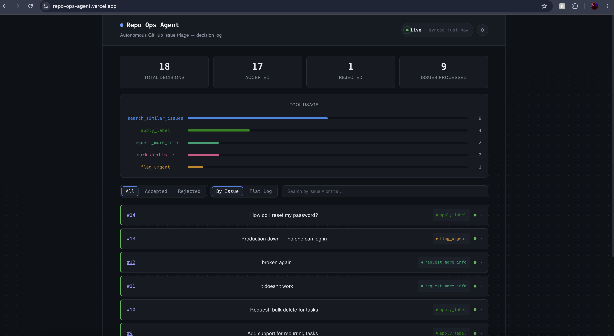
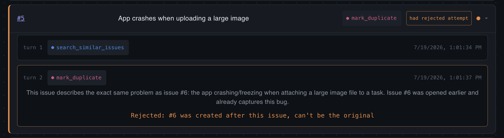

# Repo Ops Agent

**[Live dashboard](https://repo-ops-agent.vercel.app)** &nbsp;|&nbsp; **[Live API](https://repo-ops-agent-production.up.railway.app/api/health)**

An agentic AI system that triages GitHub issues on its own. It reads new issues, checks for duplicates, applies labels, flags urgent problems, and asks for more detail when a report is too vague. It runs a multi-step tool-calling loop instead of a single prompt-response call.

### How to read this project

This is a live, deployed system. Click the dashboard link above to see real agent decisions, not a mockup. The most interesting thing to look at first is **issue #5**: the agent's own reasoning was factually wrong about which of two duplicate issues came first, and a code-level check caught and rejected it before any bad label got applied. That case, and why the project is built to catch it, is covered in "Key design decisions" below.




## Why this project

Most "AI wrapper" projects are just one LLM call with a nice UI on top. This one is built around an actual decision loop: the model reads context, picks from a set of tools, looks at the result, and decides what to do next, sometimes over several turns, before taking a final action it can't undo (applying a label, marking a duplicate, flagging something urgent). The hard engineering problems live in that loop and in what surrounds it: persistence, verification, deployment, observability. Not in the prompt.

## Architecture

```
GitHub Issue
     │
     ▼
[ Fetch issue via GitHub REST API ]
     │
     ▼
[ LLM (DeepSeek, OpenAI-compatible tool-calling) ]
     │
     ├─ may call search_similar_issues (non-terminal, loops back)
     │
     ▼
[ Terminal action: apply_label | mark_duplicate | flag_urgent | request_more_info ]
     │
     ▼
[ Code-level validation before any write ]
     │
     ├────────────────────────────┐
     ▼                            ▼
[ GitHub REST API mutation ]  [ Postgres: agent_decisions ]
 (label / comment)                  │
                                     ▼
                          [ Express API (read-only) ]
                                     │
                                     ▼
                          [ React dashboard (live view) ]
```

Three separate pieces, each talking to the others through a clear interface. The agent and the API both read and write the same Postgres database. The dashboard only ever talks to the API; it never touches the database directly. That split is intentional. It's the shape a real production system would take, not a monolith that happens to work.

**Deployed infrastructure:**
- **Postgres + Express API**: Railway (containerized, Dockerfile-based deploy)
- **React dashboard**: Vercel (static build, served from a CDN)
- **CI**: GitHub Actions. Typechecks both TypeScript projects independently, builds the dashboard, and builds both Docker images on every push.

**Stack:** TypeScript end to end. Node.js and Octokit (GitHub REST API client) plus the DeepSeek API (OpenAI-compatible function calling) for the agent. PostgreSQL for persistence. Express for the read API. React (Vite) for the dashboard. Docker and docker-compose for local and deployed parity.

## Project layout

```
repo-ops-agent/
  src/          agent loop, Postgres client, seed-data reset script
  api/          Express API, reads agent_decisions, serves JSON
  dashboard/    React dashboard, fetches from the API, renders live
  Dockerfile          agent image (runs on-demand)
  api/Dockerfile      API image (self-initializes its schema on boot)
  docker-compose.yml  Postgres + API, wired together for local dev
  .github/workflows   CI: typecheck + build on every push
```

## Key design decisions

A quick-scan summary of the choices that matter most, and why. The two "findings" are real bugs the testing process caught, not hypotheticals./

**Multi-turn loop, not one-shot classification**/
One call per issue can't catch duplicates, since the model has no idea what else exists in the repo. Fixed by giving it a `search_similar_issues` tool to call before deciding, so triage becomes gather context, then decide./

**The model never touches GitHub directly**/
It only ever returns a tool name and some arguments. All GitHub writes happen in application code, not inside the model's turn. So every action the agent can take is enumerable and reviewable. It can't do anything outside its fixed toolset, no matter what it "decides."/

**<u>Finding #1: a code check caught the model being wrong about a duplicate</u>**\
Two issues described the same bug (large image uploads crashing the app). The agent marked issue #5 as a duplicate of #6, reasoning that #6 came first. That reasoning was wrong; #5 was actually the older issue. Because `mark_duplicate` independently re-checks both issues' timestamps, it rejected the bad claim before any label was applied, and logged it with `accepted: false`. On the next run, it correctly flagged #6 as the duplicate of #5.
*Takeaway: never trust the model's stated reasoning for anything you can verify in code. Prompting reduces mistakes; code prevents them.*/

**<u>Finding #2: a missing tool causes real, logged inconsistency</u>**\
Issue #14 asks how to reset a password, something already answered in the repo's FAQ. Across two test runs the agent classified it two different ways: `question` once, `enhancement` the next, reasoning the second time that the feature "doesn't seem to exist." That's not flakiness. It's the agent guessing at intent because it has no way to check the FAQ. Concrete, logged case for the `search_docs` tool on the roadmap./

**Terminal vs. non-terminal tools**/
`search_similar_issues` loops back into the conversation. `apply_label`, `mark_duplicate`, `flag_urgent`, and `request_more_info` end the run. This keeps the agent from taking two conflicting actions on the same issue in one pass./

**Every decision gets logged, not just the final one**/
Each tool call, including rejected ones, is written to Postgres before the loop continues: issue, turn, tool, arguments, reasoning, result, accepted or not, timestamp. The rejected duplicate claim from finding #1 is a real row you can query, not something pieced together from logs afterward./

**API and dashboard live on different platforms**/
The API needs a long-running server and a live database connection, so it runs on Railway. The dashboard is just static files once built, so it runs on Vercel's CDN. Each piece runs on infrastructure built for what it actually is, and either can be redeployed on its own./

**Dashboard colors are validated, not guessed**/
The five tool colors were run through a colorblind-safety and contrast checker against both light and dark themes before shipping, not picked by eye. Every color also has a text label next to it, so nothing depends on color alone./

**CORS is an explicit allowlist**/
The API only accepts requests from the deployed dashboard and from localhost during development. A wildcard was fine while everything ran locally; once the API was public, that had to change./

## What's tested

A 14-issue seed set was built to stress-test the agent's decision boundaries, not just prove happy-path behavior:

- Straightforward bugs (clear label, no ambiguity)
- A genuine duplicate pair, used to validate the ordering fix above
- Feature requests vs. bug reports (classification accuracy)
- Deliberately vague issues ("it doesn't work") to test `request_more_info` instead of the model guessing a label
- A production-outage-worded issue, to test `flag_urgent` triggering correctly instead of a generic `bug` label
- A question already answered in the repo's FAQ, to test whether the agent grounds its answer in real documentation instead of inventing one (see finding #2 above; it currently exposes a real gap instead of passing cleanly)

Every one of these runs is logged to Postgres and visible in the dashboard, including which decisions were accepted or rejected by the code-level guards.

## Known limitations / not yet built

- No `search_docs` tool yet. The agent can't ground answers in `FAQ.md`/`README.md`, which is the direct cause of finding #2 above
- No retry/backoff on the LLM API call itself (added for GitHub API calls, not yet for DeepSeek calls)
- No webhook trigger. The agent currently runs on-demand against a fixed issue list, rather than firing automatically when a new issue is opened
- Uses a personal access token for GitHub auth rather than a scoped GitHub App, which is what a real multi-repo deployment would use
- No authentication on the API or dashboard. Fine for a single-user demo, not for anything shared beyond that
- The dashboard polls the API on an interval rather than pushing updates (WebSocket/SSE would be the natural next step for true real-time)

## What I'd do differently at scale

A few things would need to change for a high-volume repo: a GitHub webhook instead of manual runs, rate-limit-aware batching instead of one issue at a time, idempotency checks so a crashed run can't double-post a comment on retry, a confidence threshold below which the agent hands off to a human instead of acting, and a GitHub App instead of a personal access token. Right now every terminal tool call is treated as equally trustworthy. That's fine for a 14-issue test set, not fine for a busy repo. The dashboard would also need auth, pagination past the current 200-row cap, and push-based updates instead of polling.
